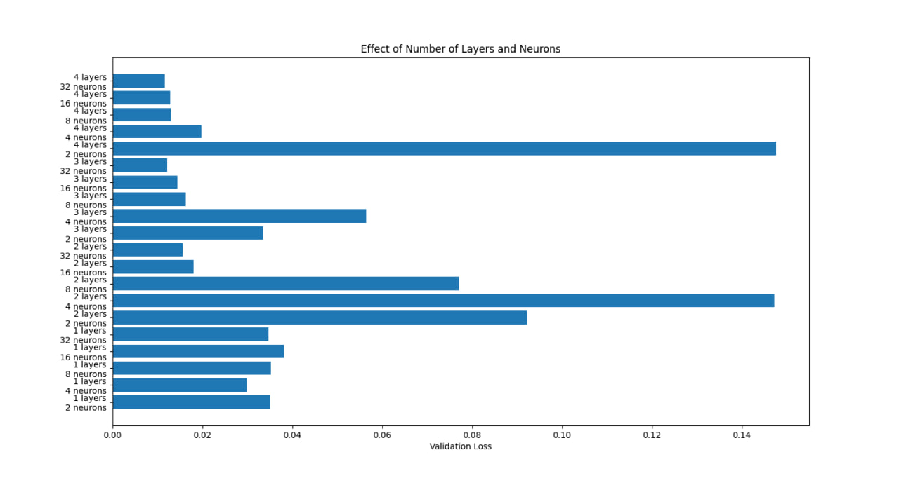

# **Инструкция**

Установите Git и Python

`git clone https://github.com/megamen32/LearningAISafety`

Затем создайте виртуальное окрудение

`python -m venv venv`

`source venv/bin/activate`

# Примеры

Наконец вы можете запустить либо модель обратного распространения ошибок 
`python BackprogationNNbasic.py`
, написанную без лишних библеотек и максимально низкоуровне, более высоуровневая модель лежит в `BackprogationNNFit.py`

Либо модель генеративно-состязательного ИИ 

`python GAN.py`

на tensorflow

## Self-supervised learning
— это подход, при котором модель обучается на неразмеченных данных, но с использованием автоматически сгенерированных меток. Вместо того, чтобы полагаться на размеченные данные, модель пытается извлечь полезную информацию из самих данных.

Простейший пример self-supervised learning — это обучение autoencoder'а. Autoencoder пытается восстановить входные данные на выходе, минимизируя разницу между входом и выходом. В этом случае, входные данные сами служат метками. Смотрите `self-supervised-learning.py`

## сколько нужно слоев и нейронов?

Попробовать построить полином степени N и посмотреть сколько слоев в линейной НН нужно для fit-а. П.С N+1
Смотрите файл [how_many_neurons.py](how_many_neurons.py)

Если в нейросети только один выходной узел, и вы считаете, что требуемая связь вход-выход довольно проста, начните с размерности скрытого слоя, равной двум третям входной размерности.
Если у вас есть несколько выходных узлов или вы считаете, что требуемая связь вход-выход является сложной, сделайте размерность скрытого слоя равной сумме входная размерность плюс выходная размерность (но при этом она должна оставаться меньше удвоенной входной размерности).
Если вы считаете, что требуемая связь вход-выход является крайне сложной, установите размерность скрытого слоя равной на единицу меньше удвоенной входной размерности.